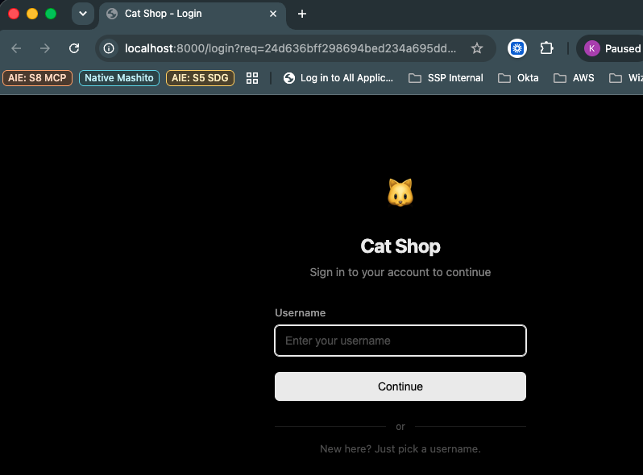
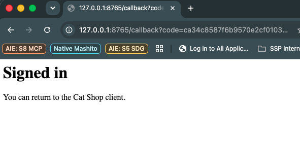
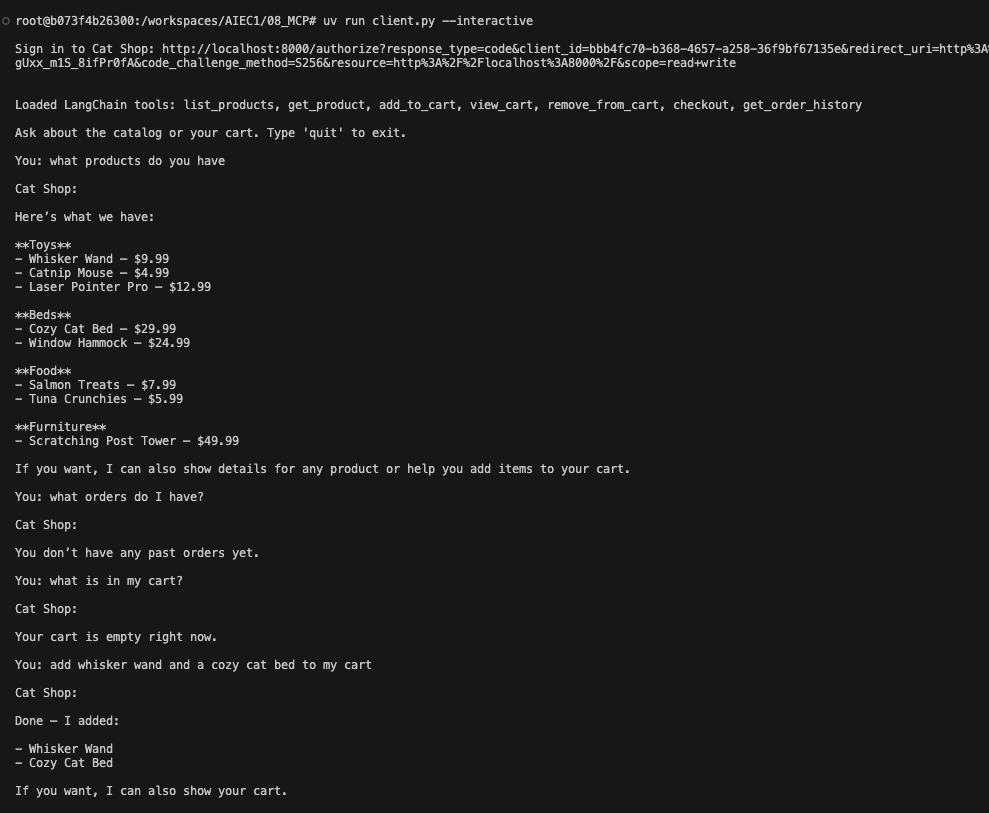
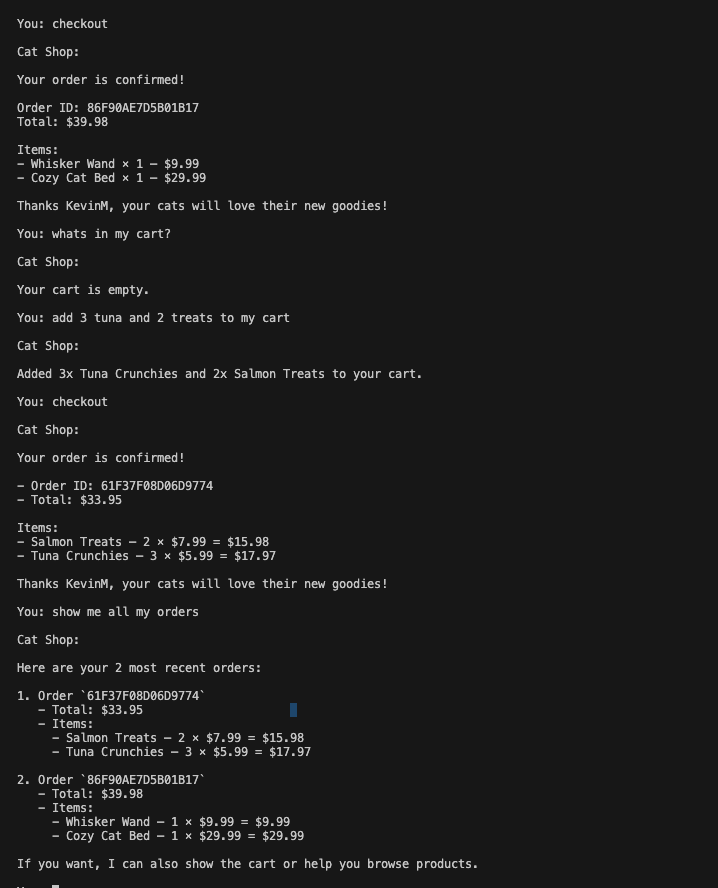
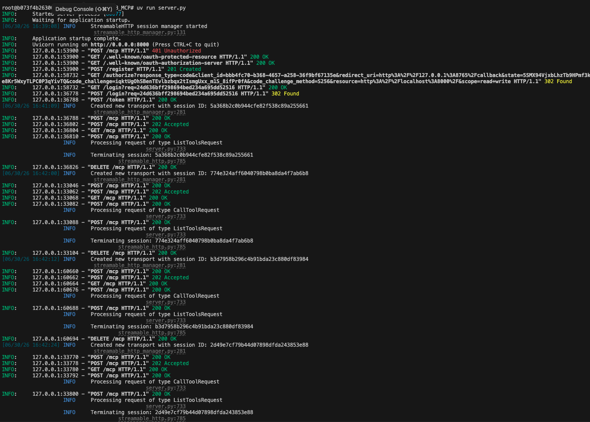
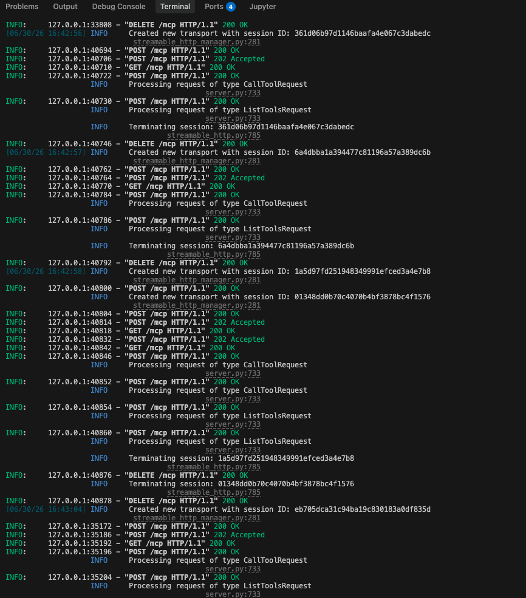
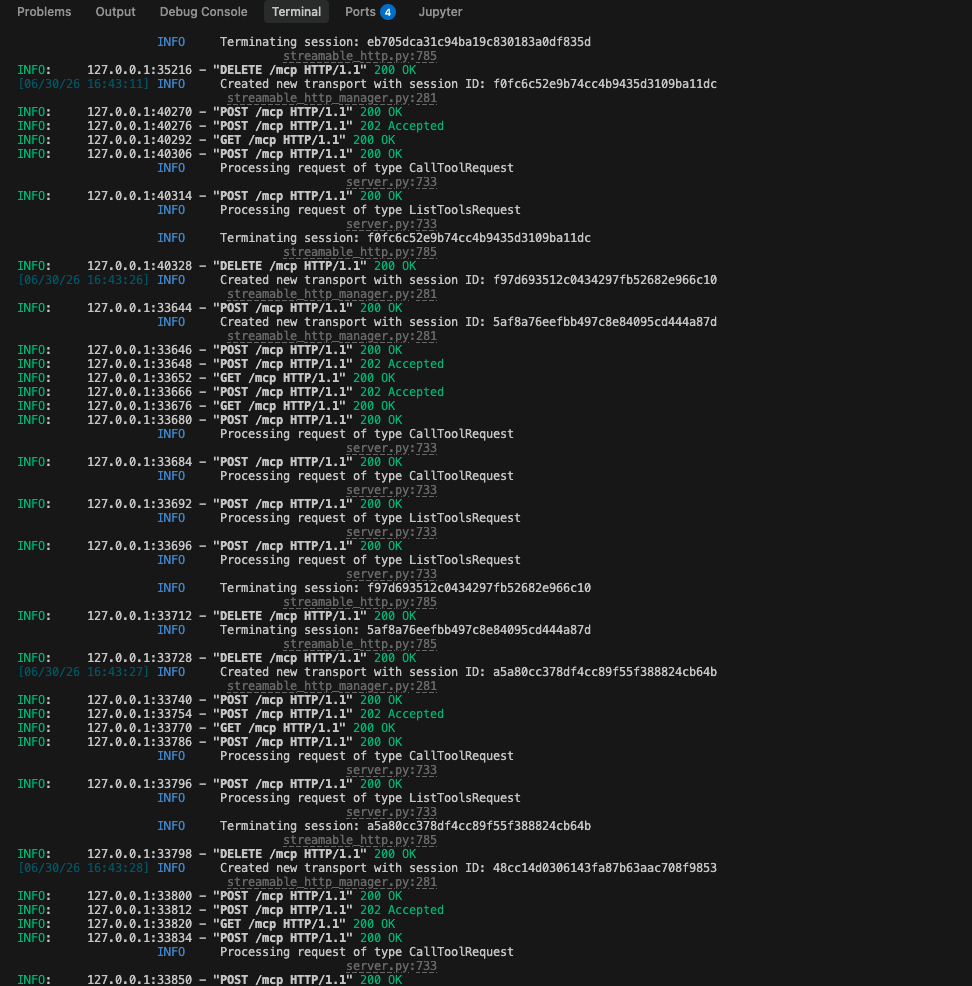
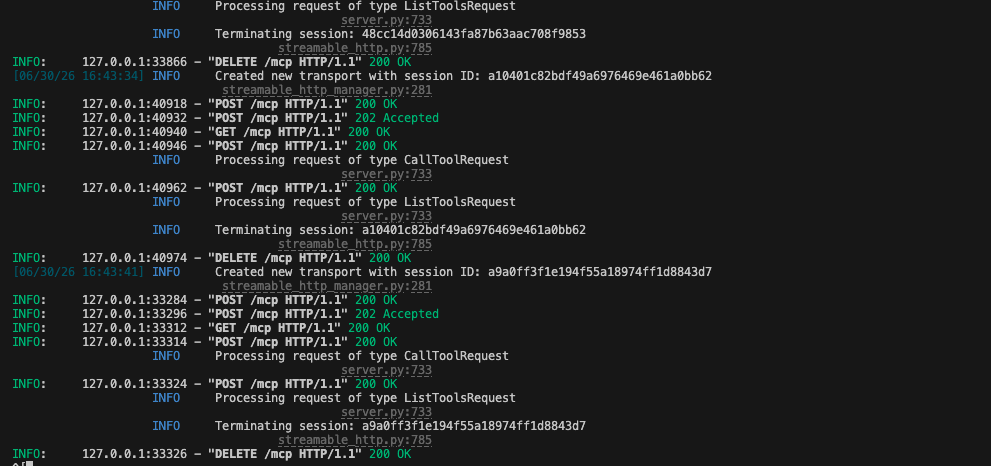

# Activity 1: Extending the Cat Shop MCP Server

## Summary

Added a new MCP tool, **`get_order_history`**, to the Cat Shop server. The new
tool returns the authenticated user's past orders (most recent first), including
each order's line items, quantities, prices, and totals. To make this possible,
`checkout` was updated to persist completed orders to SQLite, and two new
tables were added to the schema.

## What changed

### 1. New database tables — `app/db.py`

Added `orders` and `order_items` tables inside `init_db`:

```sql
CREATE TABLE IF NOT EXISTS orders (
    order_id TEXT PRIMARY KEY,
    username TEXT NOT NULL,
    total REAL NOT NULL,
    created_at REAL NOT NULL
);
CREATE TABLE IF NOT EXISTS order_items (
    id INTEGER PRIMARY KEY AUTOINCREMENT,
    order_id TEXT NOT NULL,
    product_id INTEGER NOT NULL,
    name TEXT NOT NULL,
    price REAL NOT NULL,
    quantity INTEGER NOT NULL
);
```

- `orders` is the header row (one per completed checkout).
- `order_items` snapshots the product name and price *at the time of purchase*
  so the historical record stays accurate even if a product's price later
  changes.

### 2. `checkout` now persists the order — `app/tools.py`

`checkout` previously generated an order ID and cleared the cart but threw the
order details away. It now writes an `orders` row plus one `order_items` row
per cart line before clearing the cart. The response shape returned to the
client is unchanged.

### 3. New `get_order_history` tool — `app/tools.py`

```python
@mcp.tool()
async def get_order_history(limit: int = 10) -> dict:
    """List your past orders, most recent first. Each order includes its items and total."""
```

Behavior:

- Resolves the caller via the OAuth bearer token (same `_get_username()` helper
  used by the other write tools), so each user only sees their own orders.
- Accepts an optional `limit` (clamped to 1–50) to prevent oversized responses
  when an agent calls it.
- Returns a dict shaped like:

  ```json
  {
    "orders": [
      {
        "order_id": "214D164AE8B925B2",
        "total": 15.98,
        "created_at": 1719781200.123,
        "item_count": 1,
        "items": [
          {"product_id": 6, "name": "Salmon Treats", "price": 7.99, "quantity": 2, "subtotal": 15.98}
        ]
      }
    ],
    "count": 1
  }
  ```

## OAuth integration

No new auth code was required. `get_order_history` calls `_get_username()`,
which reads the access token via `get_access_token()` from the MCP auth
middleware and looks up the associated username in `token_users`. Unauthenticated
calls raise `ValueError("Not authenticated")` exactly like every other write
tool in the server.

## Demo walkthrough

Full transcripts are committed under `terminal_output/` (`client.log` and
`server.log`). The high-level flow exercised during the demo:

1. **Sign in via OAuth.** Starting `client.py --interactive` printed an
   `/authorize` URL. Opening it loaded the Cat Shop login page, where the
   username `KevinM` was submitted. The browser was redirected back to the
   local callback at `http://127.0.0.1:8765/callback`, the client exchanged the
   code for an access token, and the LangChain agent loaded **seven** tools —
   including the new `get_order_history`.

2. **Browse the catalog.** *"what products do you have"* — the agent called
   `list_products` and returned every product grouped by category (toys, beds,
   food, furniture).

3. **Check history on a fresh account.** *"what orders do I have?"* — the
   agent called `get_order_history`, which correctly returned an empty list
   for the brand-new user.

4. **Check the empty cart.** *"what is in my cart?"* — `view_cart` confirmed
   the cart was empty.

5. **Place the first order.** *"add whisker wand and a cozy cat bed to my
   cart"* invoked `add_to_cart` twice. *"checkout"* then triggered the updated
   `checkout` tool, returning order `86F90AE7D5B01B17` totaling **$39.98** and
   (newly) persisting the order to the `orders` / `order_items` tables.

6. **Place a second order.** *"add 3 tuna and 2 treats to my cart"* added the
   food items; *"checkout"* produced order `61F37F08D06D9774` totaling
   **$33.95**.

7. **Read the new tool back.** *"show me all my orders"* invoked
   `get_order_history`, which returned both orders most-recent-first with
   their per-line totals — proving the new tool is wired up end-to-end and
   scoped to the authenticated user.

## Screenshots

All screenshots live in `demo/screenshots/`.

### OAuth login page

The Cat Shop login page that opens when the client kicks off the OAuth flow.



### OAuth callback / signed-in confirmation

The success page after submitting the username — the browser is redirected
back to the local client callback and the agent now holds an access token.



### Client interaction — part 1

First half of the interactive session: tool list (including
`get_order_history`), catalog browse, empty-history check, empty-cart check,
and placing the first order.



### Client interaction — part 2

Second half: placing the second order and calling `get_order_history` to
return both completed orders with line items and totals.



### Server terminal — part 1

Server startup and the OAuth dance: dynamic client registration, `/authorize`,
login POST, and the token exchange.



### Server terminal — part 2

MCP session establishment and the early `CallToolRequest` / `ListToolsRequest`
entries as the agent loads tools and starts browsing the catalog.



### Server terminal — part 3

`CallToolRequest` traffic for `add_to_cart`, `view_cart`, and `checkout`
during the two order placements.



### Server terminal — part 4

The `CallToolRequest` for `get_order_history` and session teardown — the new
tool being hit by an authenticated agent.




